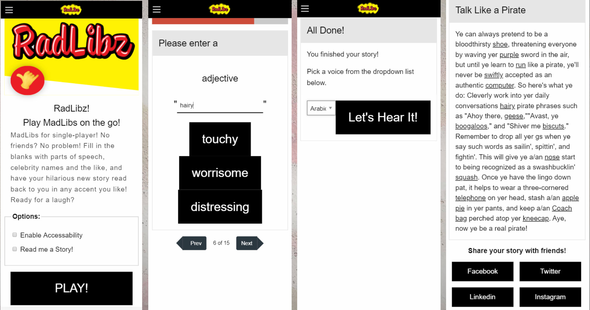

# Radlibz

## Summary

Radlibz is an interactive, single-player game of MadLibs! No friends necessary! This application prompts the user for various parts of speech, names, places, and other words. These words are inserted into a corresponding story to create a new and hilarious tale every time! This story is then read aloud to the player in their chosen accent with our text to speech functionionality.

## Prerequisites

- Web Browser (Chrome, Safari, Firefox, etc)
- [JavaScript](https://enablejavascript.co/)

## Installing

Copy the repository link.

```
https://github.com/amandalatkins/radlibz.git
```

Clone the repository to your local development environment

```
git clone https://github.com/amandalatkins/radlibz.git
```

Open ``index.html`` in your preferred web browser

## Built With

* [HTML](https://developer.mozilla.org/en-US/docs/Web/HTML)
* [CSS](https://developer.mozilla.org/en-US/docs/Web/CSS)
* [JavaScript](https://developer.mozilla.org/en-US/docs/Web/JavaScript)
* [Foundation](https://momentjs.com/)
* [ResponsiveVoice](https://responsivevoice.org/)
* [Merriam Webster Collegiate Thesaurus API](https://dictionaryapi.com/products/api-collegiate-thesaurus)
* [MadLibz API](https://madlibz.herokuapp.com/api)

## Deployed Link

* [See Live App](https://amandalatkins.github.io/radlibz)

## Game Flow Screenshots



## Code Snippets

This code snippet shows the function that integrates the player's responses with the story sentences

```
// Takes the userResponses array and the sentences array (from the MabLibz API return object) and renders the story
function renderStory() {
    // Create an empty string variable to concatenate onto as we run through our arrays
    var storyHtml = "";
    // Displays the title of the story
    $("#storyTitle").text(title);
    // Loop through all the sentences
    for (var i = 0; i < sentences.length; i++) {
        // As long as the sentences have content and aren't set to 0 (the api returns one 0)
        if (sentences[i] !== "" && sentences[i] !== 0) {
            // Replace this chracter combo with line breaks
            var sentence = sentences[i].replace('\n','<br><br>');
            // Replace this character with bullet point
            sentence = sentence.replace('*','&bull;');
            // add sentence to story
            storyHtml += sentence;
        }
        // Make sure there is a user response for this index
        if (userResponses[i]) {
            storyHtml += "<span class='user-word'>"+userResponses[i]+"</span>";
        }
    }
    // append the story to the DOM
    showStory.html(storyHtml);
    speakText(showStory);
}
```

This code snippet shows how the app receives user inputs to read the completed story aloud
```
function speakText() {
    // Get text from textbox.
    var text = $('#showStory').text();
    // Get selected voice from dropdown
    var voice = $('#voiceselection').val()
    // Speak it
    responsiveVoice.speak(text, voice)
}
```

## Authors

* ### Amanda Atkins
    - [Github](https://github.com/amandalatkins)
    - [LinkedIn](https://www.linkedin.com/in/amandalatkins)

* ### Ian Toy
    - [Github](https://github.com/ietoy)
    - [LinkedIn](https://www.linkedin.com/in/ian-toy-265077196/)

* ### Marwan Jassim
    - [Github](https://github.com/marwanjassim)
    - [LinkedIn](https://www.linkedin.com/in/marwan-jassim-b3001878/)

See also the list of [contributors](https://github.com/amandalatkins/radlibz/contributors) who participated in this project.

## License

This project is licensed under the MIT License.

[MadLibz API](https://github.com/HermanFassett/madlibz/blob/master/LICENSE) data is licened under the MIT License.

[Merriam-Webster's Collegiate Thesaurus](https://dictionaryapi.com/info/terms-of-service) data is licensed according to their terms of service.

[ResponsiveVoice-NonCommercial](https://responsivevoice.org) licensed under [](https://creativecommons.org/licenses/by-nc-nd/4.0/)

## Acknowledgments

Thanks to [TailorBrands](https://www.tailorbrands.com/) for assisting with the RadLibz logo. Special thanks to our instructor Jerome and TAs Mahisha and Kerwin for their ideas and guidance.